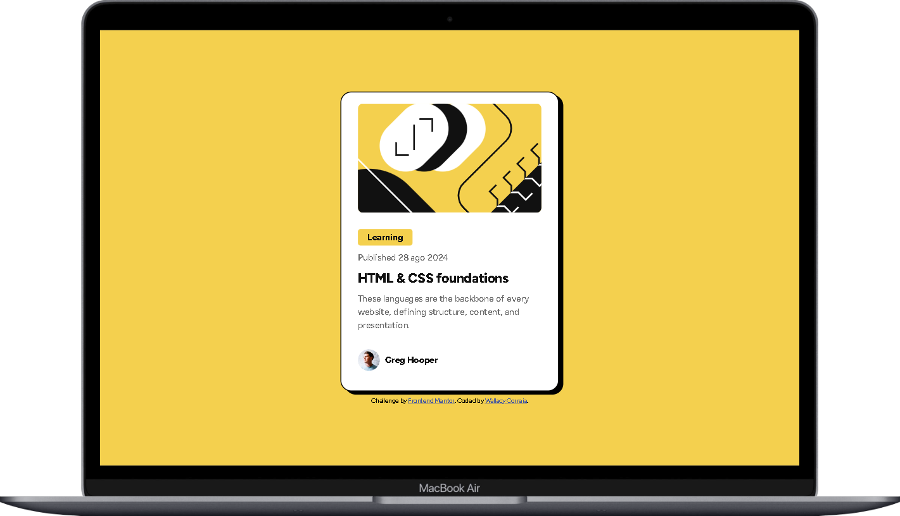
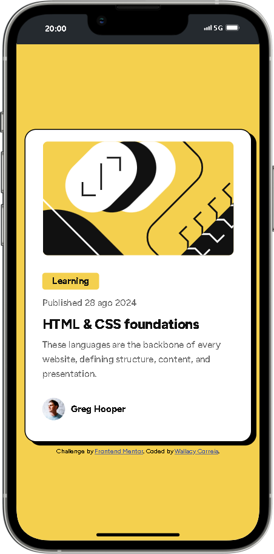

# Solução do componente QR code no Frontend Mentor

Esta é uma solução para o [desafio do componente QR code no Frontend Mentor](https://www.frontendmentor.io/challenges/blog-preview-card-ckPaj01IcS). Os desafios do Frontend Mentor ajudam você a melhorar suas habilidades de codificação construindo projetos realistas.

## Índice

- [Visão Geral](#visão-geral)
  - [Captura de Tela](#captura-de-tela)
  - [Links](#links)
- [Meu Processo](#meu-processo)
  - [Construído com](#construído-com)
  - [Desenvolvimento contínuo](#desenvolvimento-contínuo)
  - [Recursos úteis](#recursos-úteis)
- [Autor](#autor)

## Visão Geral

### Captura de Tela

### Links

- URL da Solução: [GITHUB](https://github.com/WallacyDev/blog-preview-card-main.git)
- URL da Site ao Vivo: [GITHUB-PAGES](https://wallacydev.github.io/blog-preview-card-main)

## Meu Processo

### Construído com

- Marcação HTML5 semântica
- Propriedades personalizadas CSS
- Flexbox
- Fluxo de trabalho mobile-first

### Desenvolvimento contínuo

- Proximo passo aprender javascript

### Recursos úteis

- [Recurso exemplo 1](https://htmlreference.io/lists/) - esse site tem me ajudado muito e quero aqui recomendar para aperfeiçoar o HTML de quem tambem esta iniciando.

- [Recurso exemplo 2](https://htmlreference.io/lists/) - esse site tem me ajudado muito e quero aqui recomendar para aperfeiçoar o CSS de quem tambem esta iniciando.

## Autor

- PORTIFOLIO - [Wallacy Correia](https://wallacy-dev-fullstack.vercel.app/)
- Frontend Mentor - [@WallacyDev](https://www.frontendmentor.io/profile/WallacyDev)
